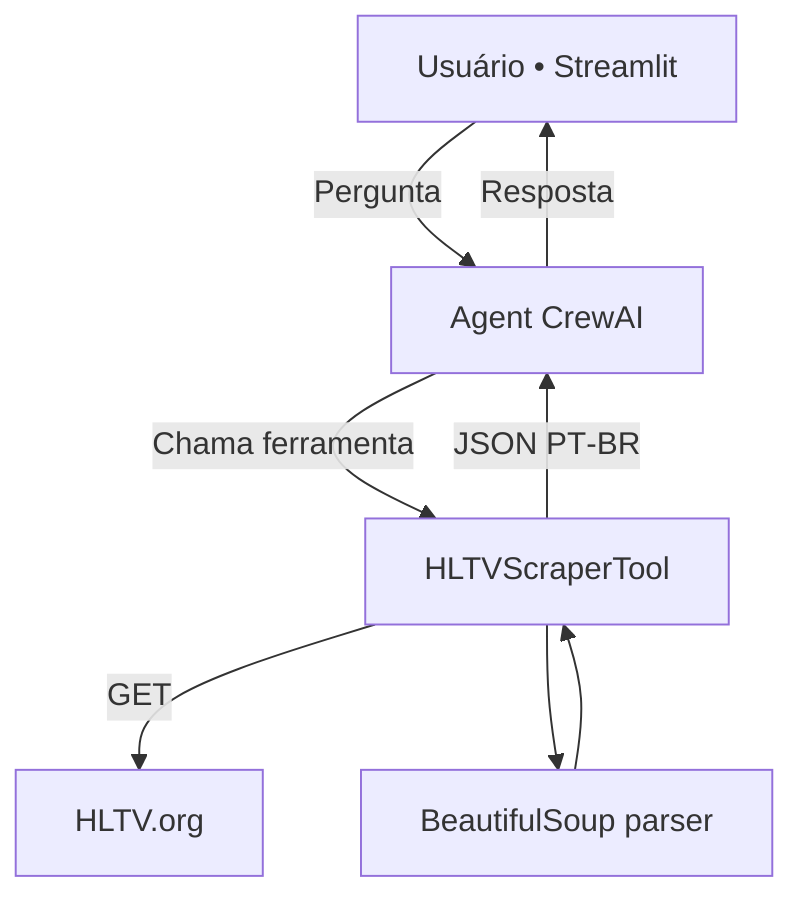

# 😼 =FuriaChat= 💬 — 🐾 Pantera Bot

**FuriaChat** é um chatbot em _Streamlit_ que responde, em português, qualquer pergunta objetiva sobre o time de Counter‑Strike da **FURIA**.  
Ele vasculha páginas públicas da **HLTV** em tempo‑real, traduz as informações e devolve respostas claras, sempre citando a fonte.

<p align="center">
  
</p>

<br>

## ✨ Funcionalidades

| Comando / Pergunta                         | O que faz                                 | Fonte HLTV                |
| ------------------------------------------ | ----------------------------------------- | ------------------------- |
| `/nextmatch` ou “Quando é o próximo jogo?” | Data, adversário e link para o confronto  | `/team/8297/furia`        |
| “Qual o rating atual da FURIA?”            | Rating 2.0, mapas mais jogados e win‑rate | `/stats/teams/8297/furia` |
| “Resultado do jogo contra MOUZ?”           | Placar, veto de mapas, MVP                | `/matches/<id>/...`       |
| “Última notícia sobre lineup”              | Título, resumo, link da notícia           | `/news/<id>/...`          |

_Tempo médio de resposta ≤ 20 s (cache em memória + GPT‑4.0‑mini)._

<br>

## 🏗️ Arquitetura



| Camada       | Stack                         |
| ------------ | ----------------------------- |
| UI           | **Streamlit 1.44**            |
| Orquestração | **CrewAI 0.114** + LiteLLM    |
| LLM          | GPT‑4o‑mini (configurável)    |
| Scraper      | `requests` + `BeautifulSoup4` |
| Cache        | `functools.lru_cache`         |

---

## 🚀 Como rodar

```bash
git clone --single-branch --branch pantera-bot https://github.com/brunocferreira/furiachat.git
cd furiachat
python3.11 -m venv .venv && source .venv/bin/activate
pip install -r requirements.txt

# .env
OPENAI_API_KEY=sk-xxxxxxxx

streamlit run app.py
```

---

## 📁 Estrutura

- `furiachat/src/furiachat/tools/hltv_scraper.py` – Scraper HLTV
- `agents/hltv_agents.py` – Tool + Agent + Task runner
- `furiachat/src/furiachat/config/pantera_bot.yaml` – Config declarativa
- `app.py` – UI Streamlit

---

## 👤 Autor

**Bruno da Cunha Ferreira**
Desenvolvedor de Sistemas • Especialista em Inteligência Artificial

[LinkedIn](https://www.linkedin.com/in/brunocferreira) · [b.c.ferreira@gmail.com](mailto:b.c.ferreira@gmail.com)

---

## 📝 Licença

MIT

> _Projeto enviado como parte do processo seletivo para **Assistente de Engenharia de Software — FURIA Tech** (2025)._
